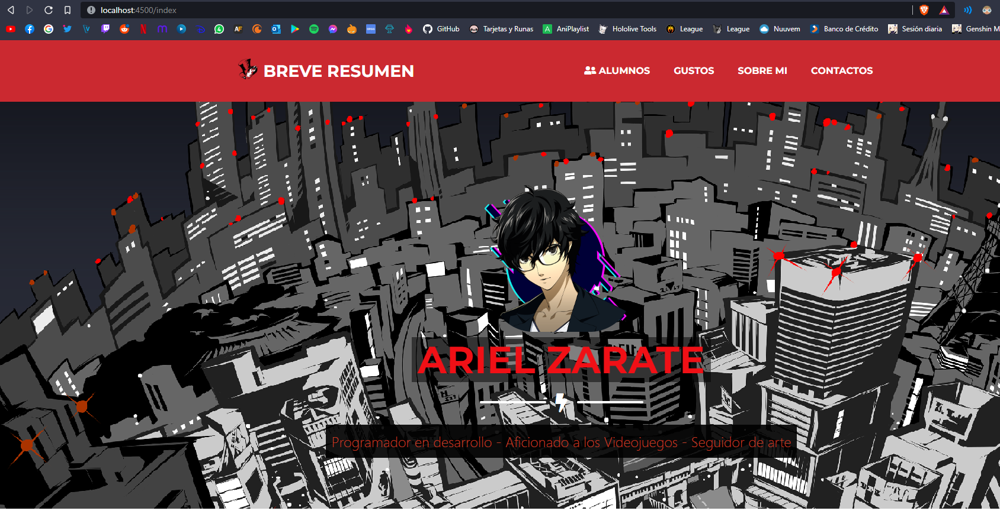

# NODEJS + MYSQL 

> Este proyecto consta de 2 paginas en NodeJS, uno siendo un index y el Otro un CRUD de agenda usando MYSQL con S3

## INSTALACIÓN

```bash
# Instalamos las dependencias para este proyecto

npm install

# Ir a la carpeta repository y dentro de aws.js editar los datos de tu AWS S3

constructor(){        
        this.s3 = new AWS.S3({
            accessKeyId: "TU_ACCES_KEY_ID",
            secretAccessKey: "TU_SECRET_ACCESS_KEY",
        });
    }

```

```bash

# EL archivo connection.js que se encuentra dentro de la carpeta database,
# recordar de actualizar a sus datos!

var conn=mysql.createConnection({
    host: 'SU_HOST',
    user: 'SU_USUARIO',
    password: 'SU_PASSWORD',
    database: 'SU_BASEDEDATOS',
    multipleStatements: true
});

# En la linea de comandos de MYSQL creamos una base de datos y la usamos

CREATE DATABASE agenda;
USE agenda;

# Luego creamos la tabla

CREATE TABLE alumnos (
    id int NOT NULL PRIMARY KEY,
    nombre varchar(255),
    apellido varchar(255),
    grado varchar(255),
    seccion varchar(255),    
    turno varchar(255),    
    imagen varchar(255));

# Y finalmente agregamos un dato a esta tabla

INSERT INTO alumnos (id, nombre, apellido, grado, seccion, turno)
    VALUES (1,'Ariel', 'Zarate' ,'5to','M','Mañana');

```

```bash
# Iniciamos este proyecto con:
npm run dev
```
> La pagina se encuentra en: http://localhost:4500/index

## CAPTURAS

> Index



> Crud


